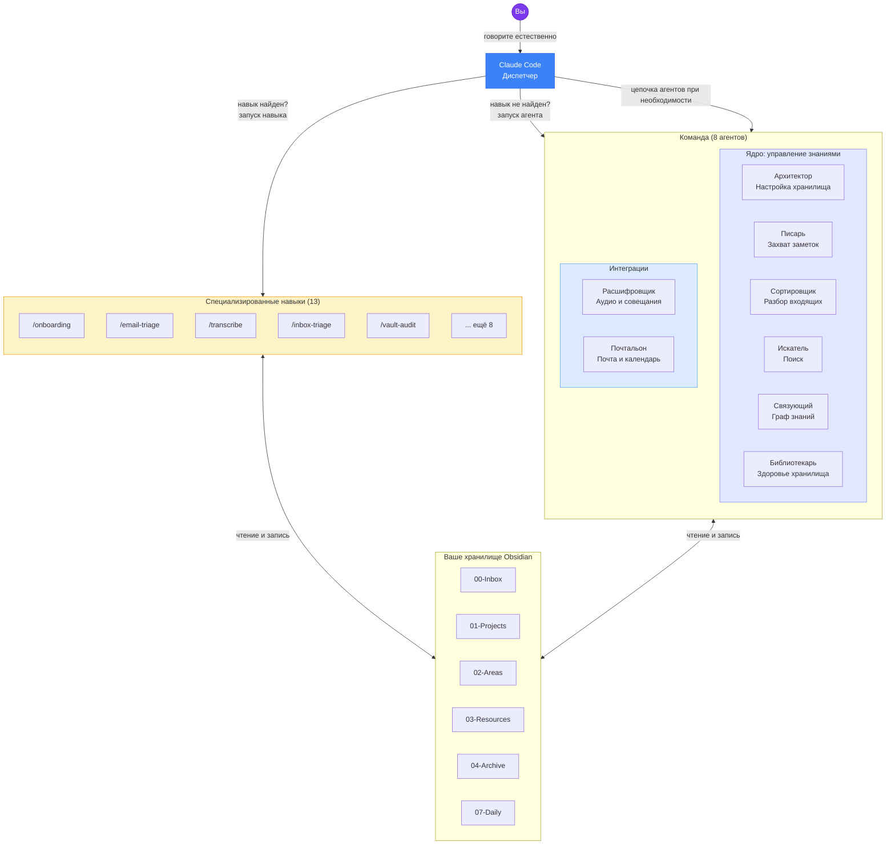
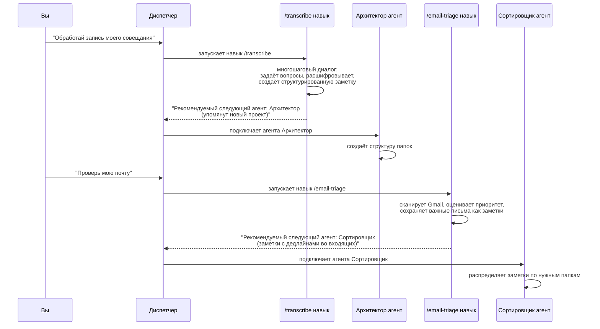

<h1 align="center">🧠 My Brain Is Full — Crew</h1>

<p align="center">
  <strong>Команда из 8+ ИИ-агентов и 13 специализированных навыков, которые управляют вашим хранилищем Obsidian,<br>чтобы вашему мозгу не приходилось этим заниматься.</strong>
</p>

<p align="center">
  Вы говорите. Они организуют, распределяют, связывают, ищут, расшифровывают и сортируют вашу почту. На любом языке.
</p>

<p align="center">
  <a href="https://discord.gg/EUnQmABw8s">
    
  </a>
</p>

<p align="center">
  
  
  
  
  
</p>

---

## Честная история создания

Я — магистрант НИУ ВШЭ. Годами я тренировал свой мозг удерживать огромные объёмы информации: статьи, идеи, дедлайны, люди, полусырые теории в два часа ночи. И какое-то время это работало.

А потом перестало.

Память начала подводить. Не драматично — никаких диагнозов, никакого кризиса — просто медленное, ползучее осознание того, что мыслительный ресурс исчерпывается, и всё больше вещей проваливается сквозь решето. Я забывал, что читал. Терял нить разговоров. Постоянное чувство отставания, постоянная перегрузка.

Я начал искать решения. Нашёл кучу связок «Obsidian + Claude» в интернете. В основном это были хитрые инструменты для захвата заметок — продвинутые поисковики для вашего «второго мозга». Полезно. Но не то, что мне было нужно.

Мне нужен был не просто «расширитель памяти». Мне нужна была **система разгрузки мозга** — то, что поможет организовать не только знания, но и мою жизнь: перегруженный разум, разрушенное здоровье, лавину писем, обязательств и дел, которые нужно было сделать ещё на прошлой неделе.

Так я это создал.

---

## Чем это отличается

Большинство инструментов «ИИ + Obsidian» созданы для **людей, у которых жизнь уже налажена** и которые хотят её оптимизировать. Этот — для тех, кто **тонет** и кому нужен спасательный круг.

**1. Чат — это и есть интерфейс.**
Я не листаю Obsidian. Не перетаскиваю файлы. Не поддерживаю сложную структуру папок вручную. Я просто разговариваю с Claude. Всё остальное происходит автоматически.

**2. Система говорит на вашем языке. Буквально.**
Система работает на любом языке. Вам не нужно думать на английском, чтобы управлять своим мозгом. Просто говорите на русском, итальянском, французском, немецком, испанском, японском — на любом языке, который вам удобен. Агенты подстроятся.

**3. Агенты координируются через диспетчера.**
Когда навык расшифровки обрабатывает совещание и обнаруживает новый проект, диспетчер автоматически подключает Архитектора для создания структуры папок. Это команда, а не набор изолированных инструментов.

**4. 8 агентов — это только начало. Создавайте своих.**
В комплекте идут 8 агентов. Но ваша жизнь не стандартная, и ваша система тоже не должна быть такой. Скажите «создай нового агента» — и Архитектор проведёт вас через диалог, чтобы спроектировать агента с нуля. Без кода, без конфигурационных файлов, без шаблонов для редактирования. Вы описываете, что вам нужно — он это создаёт.

| Ваша проблема | Ваш агент |
|---|---|
| *«Я могу тратить только 300 евро в месяц на продукты, и я постоянно теряю счёт»* | **budget-tracker**: отслеживает заметки о тратах, предупреждает, когда приближаетесь к лимиту |
| *«Мой партнёр говорит, что я одеваюсь так, будто выбираю одежду с закрытыми глазами»* | **wardrobe-coach**: отслеживает ваш гардероб, предлагает образы из заметок и мягко останавливает вас от того, чтобы надеть ту рубашку снова |
| *«Я постоянно покупаю одно и то же в IKEA, потому что забываю, что уже есть дома»* | **home-inventory**: каталогизирует ваши вещи по комнатам, спасает от третьей одинаковой разделочной доски |
| *«Я постоянно начинаю побочные проекты и бросаю их»* | **project-pulse**: еженедельная проверка всех активных проектов, пометка застоявшихся |
| *«У меня три фриланс-клиента, и я путаю их дедлайны»* | **client-tracker**: собирает дедлайны по каждому клиенту из заметок и календаря |

Пользовательские агенты координируются с основной командой, автоматически обнаруживаются Claude Code и отвечают на вашем языке. Они просто решают проблемы, специфичные для **вашей** жизни.

> **Ваши пользовательские агенты — ваша ответственность.** Пользовательские агенты создаются вами и работают с вашими данными. Проект не даёт никаких гарантий относительно их поведения. Смотрите [Условия использования](TERMS_OF_USE.md).

---

## Для кого это

- Аспиранты, исследователи, учёные, тонущие в статьях и обязательствах
- Все, у кого **мозговой туман** или просто перегруженная рабочая память
- Люди, для которых английский — не родной язык, и которым нужна система, работающая на их языке
- Все, кто пробовал Obsidian и бросил, потому что это ощущалось как вторая работа

Если вы когда-нибудь думали *«Мне нужно навести порядок, но я слишком измотан, чтобы наводить порядок»* — это для вас.

---

## Важные оговорки

> **Пожалуйста, прочитайте [полный текст оговорок](docs/DISCLAIMERS.md) перед использованием проекта.**

Ключевые моменты:

- **Это ПО предназначено для личного использования с вашими собственными данными.** Вы несёте ответственность за соблюдение GDPR/CCPA, если обрабатываете данные третьих лиц (например, письма, содержащие информацию о других людях).
- **Без гарантий.** Предоставляется «как есть». Делайте резервные копии хранилища. Автор не несёт ответственности.
- **Без ответственности за форки или злоупотребления.** Это инструмент для личной продуктивности. Злонамеренное использование категорически осуждается.

> **Используя это ПО, вы соглашаетесь с [Условиями использования](TERMS_OF_USE.md).** Во время онбординга Архитектор попросит вас явно принять эти условия перед продолжением.

---

## Команда (The Crew)

| # | Агент | Роль | Суперспособность |
|---|-------|------|-----------------|
| 1 | **Архитектор (Architect)** | Структура хранилища и настройка | Проектирует всё хранилище, проводит онбординг, устанавливает правила для остальных |
| 2 | **Писарь (Scribe)** | Захват текста | Превращает ваши сумбурные, полные опечаток потоки сознания в чистые заметки |
| 3 | **Сортировщик (Sorter)** | Разбор входящих | Каждый вечер очищает папку входящих и направляет каждую заметку на своё место |
| 4 | **Искатель (Seeker)** | Поиск и аналитика | Найдёт что угодно в хранилище, синтезирует ответы из заметок с указанием источников |
| 5 | **Связующий (Connector)** | Граф знаний | Обнаруживает скрытые связи между заметками — даже те, о которых вы бы не подумали |
| 6 | **Библиотекарь (Librarian)** | Обслуживание хранилища | Еженедельные проверки здоровья, дедупликация, починка битых ссылок, аналитика роста |
| 7 | **Расшифровщик (Transcriber)** | Аудио и совещания | Превращает записи и транскрипты в подробные, структурированные заметки совещаний |
| 8 | **Почтальон (Postman)** | Почта и календарь | Связывает почту (Gmail или Hey.com) и Google Calendar с хранилищем: радар дедлайнов, подготовка к встречам |

> **Агенты + Навыки = полная система.** Каждый агент выполняет быстрые, реактивные задачи. Для сложных многошаговых процессов (вроде онбординга, разбора почты или аудита хранилища) диспетчер направляет запрос одному из **13 специализированных навыков**, которые работают в формате управляемого диалога. Смотрите раздел [Навыки](#навыки-skills) ниже.

---

## Навыки (Skills)

Навыки обрабатывают сложные многошаговые процессы, требующие диалогового контекста. Агенты хороши для быстрых одноразовых задач, но некоторые операции — вроде онбординга или разбора почты — требуют диалога с вопросами и ответами. Навыки работают в основном контексте разговора, поэтому они могут задавать вопросы, ждать ответов и естественно сохранять состояние.

Диспетчер автоматически направляет ваше сообщение нужному навыку или агенту. Вам не нужно запоминать, что есть что.

| Навык | Что делает | Извлечён из |
|-------|-----------|-------------|
| `/onboarding` | Полный диалог настройки хранилища | Архитектор |
| `/create-agent` | Пошаговое проектирование пользовательского агента | Архитектор |
| `/manage-agent` | Редактирование, удаление или просмотр пользовательских агентов | Архитектор |
| `/defrag` | Еженедельная дефрагментация хранилища (5 фаз) | Архитектор |
| `/email-triage` | Сканирование и приоритизация непрочитанных писем | Почтальон |
| `/meeting-prep` | Комплексная подготовка к встрече | Почтальон |
| `/weekly-agenda` | Обзор недели по дням | Почтальон |
| `/deadline-radar` | Единая шкала дедлайнов | Почтальон |
| `/transcribe` | Обработка записей в структурированные заметки | Расшифровщик |
| `/vault-audit` | Полный 7-фазный аудит хранилища | Библиотекарь |
| `/deep-clean` | Расширенная чистка хранилища | Библиотекарь |
| `/tag-garden` | Анализ и чистка тегов | Библиотекарь |
| `/inbox-triage` | Обработка и маршрутизация заметок из входящих | Сортировщик |

---

## Как это работает

```
Вы говорите с Claude  →  Диспетчер сначала проверяет навыки  →  Совпадение: запускает навык
                                                               →  Нет совпадения: запускает агента  →  Хранилище обновляется
```

У диспетчера два механизма делегирования. **Навыки** обрабатывают сложные многошаговые диалоговые процессы (онбординг, разбор почты, аудит хранилища). **Агенты** выполняют быстрые реактивные одноразовые операции (сохранить заметку, поиск в хранилище, создать папку). Навыки проверяются первыми, потому что охватывают наиболее масштабные рабочие процессы. Если навык не найден, диспетчер передаёт управление агентам.

Каждый член команды — это изолированный ИИ со своим системным промптом, ограничениями инструментов и назначенной моделью. Вы клонируете репозиторий в хранилище, запускаете скрипт установки, и с этого момента управляете всем через разговор. Никакого графического интерфейса, перетаскиваний, ручного управления файлами.

### Архитектура



### Координация агентов и навыков



### Работает и в CLI, и в Claude Code Desktop (Cowork)

Установщик настраивает **два параллельных слоя**, чтобы Команда работала везде:

| Слой | Расположение | Назначение |
|------|-------------|-----------|
| **Агенты** | `.claude/agents/` | Лёгкие реактивные агенты для одноразовых задач (захват, поиск, создание) |
| **Навыки** | `.claude/skills/` | Специализированные многошаговые процессы для сложных задач (онбординг, разбор, аудит) |

Оба слоя работают в CLI и Desktop. `launchme.sh` устанавливает оба автоматически. Диспетчер решает, запустить навык или агента, на основе вашего сообщения.

Ваше хранилище следует гибридной структуре **PARA + Zettelkasten**:

```
00-Inbox/          Сначала всё попадает сюда
01-Projects/       Активные проекты с дедлайнами
02-Areas/          Текущие зоны ответственности
03-Resources/      Справочные материалы, руководства, инструкции
04-Archive/        Завершённый или исторический контент
05-People/         Ваша персональная CRM
06-Meetings/       Заметки совещаний с временными метками
07-Daily/          Ежедневные заметки и дневники
MOC/               Карты контента (тематические указатели)
Templates/         Шаблоны заметок Obsidian
Meta/              Конфигурация хранилища, логи агентов, отчёты о здоровье
```

---

## Быстрый старт

> **Предварительное условие**: вам нужен [Claude Code](https://claude.ai/code) с подпиской Claude Pro, Max или Team, а также [Obsidian](https://obsidian.md) (бесплатный).

### 1. Создайте хранилище Obsidian

Откройте Obsidian и создайте новое хранилище (или используйте существующее).

### 2. Клонируйте репозиторий внутрь хранилища

```bash
cd /path/to/your-vault
git clone https://github.com/gnekt/My-Brain-Is-Full-Crew.git
```

### 3. Запустите установщик

```bash
cd My-Brain-Is-Full-Crew
bash scripts/launchme.sh
```

Скрипт задаст пару вопросов и скопирует агентов и навыки в директорию `.claude/` вашего хранилища. Вот и всё. Когда Claude Code открыт в папке вашего хранилища, агенты активируются автоматически. Когда вы работаете в другом проекте — они не мешают.

> **Никогда не работали с терминалом?** Смотрите [пошаговое руководство для начинающих](docs/getting-started.md). Там расписано всё по шагам, или просто покажите эту страницу знакомому, разбирающемуся в технике. Установка занимает 60 секунд.

### 4. Инициализация

Откройте Claude Code **внутри папки вашего хранилища** и скажите:

> **«Инициализируй моё хранилище»**

Навык `/onboarding` начнёт дружелюбный управляемый диалог:

1. **Кто вы?** Имя, язык, род деятельности, что привело сюда
2. **Что вам нужно?** Какие агенты активировать, какие сферы жизни управлять
3. **Интеграции** Подключение Gmail и Google Calendar

После онбординга Архитектор создаёт полную структуру папок хранилища, сохраняет ваш профиль, оставляет приветственную заметку — и вы готовы к работе.

### 5. Начните использовать

| Вы говорите | Что происходит |
|------------|---------------|
| *«Сохрани: встреча с Марко по бюджету Q3, он хочет отчёт к пятнице»* | Агент **Писарь** сохраняет это как аккуратную заметку с задачами, вики-ссылками и дедлайном |
| *«Разбери входящие»* | Навык `/inbox-triage` раскладывает всё по местам, обновляет карты контента, выдаёт сводку |
| *«Что мы решили по стратегии ценообразования?»* | Агент **Искатель** ищет в хранилище, синтезирует ответ с указанием источников |
| *«Проверь мою почту»* | Навык `/email-triage` сканирует Gmail, сохраняет важные письма, отмечает дедлайны |
| *«Еженедельный обзор»* | Навык `/vault-audit` запускает полный аудит хранилища: битые ссылки, дубликаты, оценка здоровья |
| *«Найди связи для моей последней заметки»* | Агент **Связующий** обнаруживает скрытые связи с другими заметками в хранилище |

---

## Работает на любом языке

Команда создана на английском, но **отвечает на том языке, на котором вы пишете**. Русский, итальянский, французский, испанский, немецкий, португальский, японский — просто говорите, и агенты подстроятся.

```
"Сохрани быструю заметку..."              → Писарь отвечает на русском
"Salva questa nota veloce..."             → Писарь отвечает на итальянском
"Vérifie mon email..."                    → Почтальон отвечает на французском
"Was habe ich diese Woche geplant?"       → Искатель отвечает на немецком
"Check my inbox"                          → Сортировщик отвечает на английском
```

Никаких переводов для установки. Никаких языковых пакетов. Просто работает.

---

## Работает и с телефона

Вы можете управлять Командой с телефона через функцию **Remote Control** в Claude Code. Ваш компьютер запускает Claude Code локально (с полным доступом к хранилищу и агентам), а телефон выступает удалённым интерфейсом через браузер или мобильное приложение Claude.

Запишите быструю мысль на прогулке. Проверьте почту с дивана. Поищите в хранилище из супермаркета. Всё выполняется на вашем компьютере — телефон лишь пульт управления.

> **[Полное руководство по настройке](docs/mobile-access.md)** (занимает 2 минуты)

---

## Координация агентов

Агенты координируются через систему оркестрации, управляемую диспетчером. Когда агент или навык завершает задачу и обнаруживает работу для другого агента, он сигнализирует диспетчеру через раздел `### Suggested next agent` в своём ответе. Диспетчер считывает это и автоматически подключает следующего агента:

- Навык `/transcribe` обрабатывает совещание, на котором упоминается новый проект — диспетчер подключает **Архитектора** для создания структуры папок
- Навык `/email-triage` находит письма с дедлайнами — диспетчер подключает **Сортировщика** для их распределения
- **Связующий** находит осиротевшие заметки — диспетчер подключает **Библиотекаря** для расследования
- **Сортировщик** находит заметки, относящиеся к новой области — диспетчер подключает **Архитектора** для её создания

Ни один агент не работает изолированно. Команда — это больше, чем сумма её частей.

---

## Необходимые интеграции

Агент **Почтальон** (и связанные навыки: `/email-triage`, `/meeting-prep`, `/weekly-agenda`, `/deadline-radar`) требует одного из:
- **Google Workspace CLI** (`gws`) — полный доступ на чтение/запись к Gmail и Google Calendar: поиск, чтение, архивация, удаление, управление метками, отправка писем; создание/изменение/удаление событий календаря. Инструкция по настройке: [`docs/gws-setup-guide.md`](docs/gws-setup-guide.md).
- **Hey CLI** (`hey`) — для аккаунтов Hey.com. Чтение/ответ/написание писем, использует предварительно отсортированные ящики Hey (Imbox, Feed, Paper Trail, Reply Later, Set Aside, Bubble Up). Операции с календарём по-прежнему используют `gws`. Установка: [Hey CLI](https://github.com/basecamp/hey-cli).
- **MCP-коннекторы** (резервный вариант, только чтение) — `launchme.sh` предложит автоматически настроить `.mcp.json`. Ограничен чтением писем и событий календаря, а также созданием черновиков.

Вы можете использовать `gws` и `hey` одновременно, если у вас есть и Gmail, и Hey.com аккаунты. Все остальные агенты и навыки работают только с вашим локальным хранилищем Obsidian. Никаких интеграций не требуется.

### Обновление

После загрузки новых изменений из репозитория:

```bash
cd /path/to/your-vault/My-Brain-Is-Full-Crew
git pull
bash scripts/updateme.sh
```

Обновляются только изменённые файлы. Ваши заметки в хранилище не затрагиваются.

---

## Рекомендуемые плагины Obsidian

**Обязательные:** Templater, Dataview, Calendar, Tasks

**Рекомендуемые:** QuickAdd, Folder Notes, Tag Wrangler, Natural Language Dates, Periodic Notes, Omnisearch, Linter

---

## Структура проекта

```
My-Brain-Is-Full-Crew/               ← клонирован внутрь хранилища
├── agents/                          8 основных агентов
│   ├── architect.md                   Настройка хранилища и онбординг
│   ├── scribe.md                      Захват текста и создание заметок
│   ├── sorter.md                      Разбор входящих и распределение
│   ├── seeker.md                      Поиск и извлечение знаний
│   ├── connector.md                   Граф знаний и анализ связей
│   ├── librarian.md                   Здоровье и обслуживание хранилища
│   ├── transcriber.md                 Расшифровка аудио и совещаний
│   └── postman.md                     Интеграция с почтой и календарём
├── skills/                          13 специализированных навыков
│   ├── onboarding/SKILL.md            Полный диалог настройки хранилища
│   ├── create-agent/SKILL.md          Пошаговое проектирование агента
│   ├── manage-agent/SKILL.md          Редактирование, удаление, просмотр агентов
│   ├── defrag/SKILL.md                Еженедельная дефрагментация хранилища
│   ├── email-triage/SKILL.md          Сканирование и приоритизация почты
│   ├── meeting-prep/SKILL.md          Комплексная подготовка к встрече
│   ├── weekly-agenda/SKILL.md         Обзор недели по дням
│   ├── deadline-radar/SKILL.md        Единая шкала дедлайнов
│   ├── transcribe/SKILL.md            Обработка записей в структурированные заметки
│   ├── vault-audit/SKILL.md           Полный 7-фазный аудит хранилища
│   ├── deep-clean/SKILL.md            Расширенная чистка хранилища
│   ├── tag-garden/SKILL.md            Анализ и чистка тегов
│   └── inbox-triage/SKILL.md          Обработка и маршрутизация входящих заметок
├── references/                      Общая документация для агентов
├── scripts/
│   ├── launchme.sh                    Установщик первого запуска
│   └── updateme.sh                    Обновление после git pull
├── docs/                            Пользовательская документация
│   ├── getting-started.md             Пошаговое руководство по установке
│   ├── examples.md                    Примеры реального использования
│   └── agents/                        Подробно о каждом агенте
├── .mcp.json                        MCP-серверы — резервный вариант только для чтения (см. docs/gws-setup-guide.md для полного доступа)
├── .claude-plugin/plugin.json       Манифест плагина (для --plugin-dir)
├── LICENSE
├── README.md                        Вы здесь
└── CONTRIBUTING.md
```

После запуска `launchme.sh` ваше хранилище выглядит так:

```
your-vault/
├── .claude/
│   ├── agents/          ← лёгкие реактивные агенты
│   ├── skills/          ← специализированные многошаговые навыки
│   └── references/      ← общие документы
├── CLAUDE.md            ← инструкции проекта (маршрутизация диспетчера)
├── .mcp.json            ← Gmail + Calendar резервный вариант только для чтения (если включено)
├── My-Brain-Is-Full-Crew/  ← репозиторий (для обновлений)
└── ... ваши заметки Obsidian
```

---

## Участие в разработке (серьёзно, помогите)

Это начиналось как инструмент выживания одного человека. Я делюсь им, потому что верю, что он может помочь другим, но **я знаю, что его можно сделать намного лучше**, и мне нужна помощь людей, которые разбираются в Claude Code, промпт-инжиниринге и Obsidian лучше меня.

**Каждый PR приветствуется.** Я серьёзно. Если вы видите что-то, что можно улучшить — лучшую структуру промптов, более умное поведение агента, более элегантную архитектуру — пожалуйста, отправляйте. Я не буду цепляться за свой код. Цель — помогать людям, а не защищать своё эго.

Если вы хотите:
- **Улучшить агента или навык**: сделать умнее, добавить режим, исправить крайние случаи
- **Исправить мои промпты**: если вы знаете лучшие паттерны — научите меня
- **Предложить нового члена команды**: нового агента или навык для новой области
- **Сообщить об ошибке**: что-то, что агент делает неправильно
- **Добавить примеры**: поделиться тем, как вы используете Команду
- **Просто сказать, что я делаю не так**: я выслушаю

...PR, issues и честная обратная связь — всё приветствуется. Смотрите [CONTRIBUTING.md](CONTRIBUTING.md).

---

## Философия

> *«Лучшая система организации — та, которую вы реально используете.»*

Команда создана для людей, которые перегружены, а не для тех, кто наслаждается организацией. Каждое проектное решение отдаёт приоритет **минимальному трению**:

- **Чат — это интерфейс**: никакого ручного управления файлами
- **Навыки берут на себя тяжёлую работу**: многошаговые процессы проходят как управляемые диалоги
- **Агенты берут на себя мелочи**: распределение, связывание, захват, поиск
- **Любой язык, в любое время**: вашему мозгу не нужно переключать язык, чтобы оставаться организованным
- **Консервативность по умолчанию**: агенты никогда не удаляют, всегда архивируют. Они спрашивают, прежде чем принимать серьёзные решения.

---

## Поставьте звезду

Если Команда помогла вам, или вам просто кажется, что это крутая идея — поставьте звезду этому репозиторию. Это помогает другим найти его и мотивирует дальнейшую разработку.

---

## Лицензия

MIT: используйте, модифицируйте, делитесь. Просто сохраните указание авторства.

**ПРОГРАММНОЕ ОБЕСПЕЧЕНИЕ ПРЕДОСТАВЛЯЕТСЯ «КАК ЕСТЬ», БЕЗ КАКИХ-ЛИБО ГАРАНТИЙ, ЯВНЫХ ИЛИ ПОДРАЗУМЕВАЕМЫХ.** Авторы не несут ответственности за любые претензии, убытки или иную ответственность, возникающую в связи с использованием данного ПО. Полный текст лицензии смотрите в [MIT License](LICENSE).

---

<p align="center">
  <i>Создано тем, кто устал забывать вещи.</i>
  <br><br>
  <a href="docs/getting-started.md"><strong>Начать работу</strong></a> · <a href="docs/examples.md"><strong>Примеры</strong></a> · <a href="docs/agents/architect.md"><strong>Познакомиться с агентами</strong></a> · <a href="CONTRIBUTING.md"><strong>Участвовать</strong></a>
</p>
