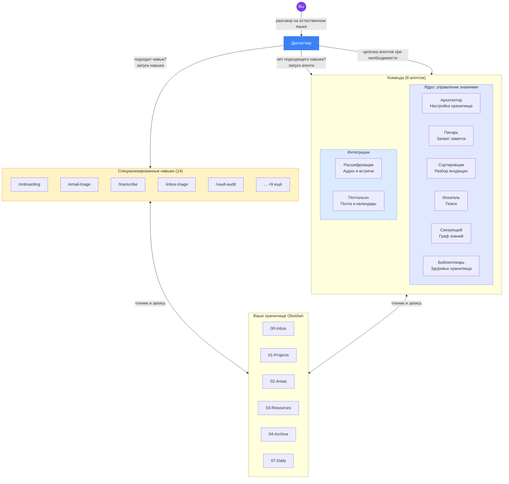
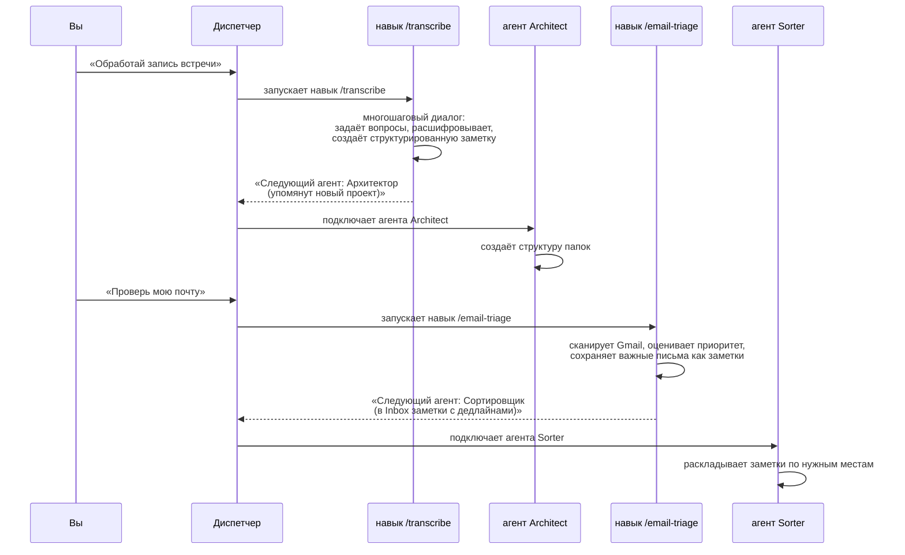

<h1 align="center">🧠 Russian-brain-Is-full-crew</h1>

<p align="center">
  <strong>Команда из 8+ ИИ-агентов и 14 специализированных навыков, которые управляют вашим хранилищем Obsidian,<br>чтобы вашему мозгу не приходилось этим заниматься.</strong>
</p>

<p align="center">
  Вы говорите. Они организуют, распределяют, связывают, ищут, расшифровывают и сортируют вашу почту.<br>
  На любом языке. На той платформе, которой вы уже пользуетесь.
</p>

<p align="center">
  
  
  
  
</p>

<p align="center">
  <em>Один код. Четыре платформы. Одна команда.</em>
</p>

<p align="center">
  
  
  
  
  
</p>

---

## Честная история создания

Годами я тренировал свой мозг удерживать огромные объёмы информации: статьи, идеи, дедлайны, люди, полусырые теории в два часа ночи. И какое-то время это работало.

А потом перестало.

Память начала подводить. Не драматично — никаких диагнозов, никакого кризиса — просто медленное, ползучее осознание того, что мыслительный ресурс исчерпывается, и всё больше вещей проваливается сквозь решето. Я забывал, что читал. Терял нить разговоров. Постоянное чувство отставания, постоянная перегрузка.

Я начал искать решения. В интернете нашлось много сборок Obsidian + Claude. В большинстве своём это были продвинутые инструменты захвата заметок, красивые поисковики для вашего «второго мозга». Полезно. Но не то, что мне было нужно.

Мне нужно было не просто расширение памяти. Мне нужна была **система разгрузки мозга** — то, что поможет организовать не только знания, но и жизнь: перегруженный ум, расшатанное физическое здоровье, лавину писем, обязательств и дел, которые нужно было сделать ещё на прошлой неделе.

Поэтому я собрал это.

---

## Что здесь необычного

Большинство инструментов «AI + Obsidian» сделано для **людей, у которых жизнь уже налажена** и которые хотят её оптимизировать. Этот — для тех, кто **тонет** и нуждается в спасательном круге.

**1. Чат — это интерфейс.**
Я не открываю Obsidian. Я не перетаскиваю файлы. Я не поддерживаю вручную сложную структуру папок. Я просто разговариваю с Claude. Всё остальное происходит автоматически.

**2. Он говорит буквально на вашем языке.**
Система работает на любом языке. Вам не должно приходиться думать по-английски, чтобы управлять своим мозгом. Пишите по-русски, по-итальянски, по-французски, по-немецки, по-японски — как удобно. Агенты подстраиваются под вас.

**3. Агенты координируются через диспетчер.**
Когда расшифровщик обрабатывает встречу и обнаруживает новый проект, диспетчер автоматически подключает Архитектора, чтобы тот создал структуру папок. Это команда, а не набор изолированных инструментов.

**4. 8 агентов — это только начало. Создавайте своих.**
В комплекте идут 8 агентов. Но ваша жизнь не стандартная, и ваша система тоже не должна быть такой. Скажите «создай нового агента» — и Архитектор проведёт вас через диалог, чтобы спроектировать агента с нуля. Без кода, без конфигурационных файлов, без шаблонов для редактирования. Вы описываете, что вам нужно — он это создаёт.

| Ваша проблема | Ваш агент |
|---|---|
| *«Я могу тратить только 300 евро в месяц на продукты, и я постоянно теряю счёт»* | **budget-tracker**: отслеживает заметки о тратах, предупреждает, когда приближаетесь к лимиту |
| *«Мой партнёр говорит, что я одеваюсь так, будто выбираю одежду с закрытыми глазами»* | **wardrobe-coach**: отслеживает ваш гардероб, предлагает образы из заметок и мягко останавливает вас от того, чтобы надеть ту рубашку снова |
| *«Я постоянно покупаю одно и то же в IKEA, потому что забываю, что уже есть дома»* | **home-inventory**: каталогизирует ваши вещи по комнатам, спасает от третьей одинаковой разделочной доски |
| *«Я постоянно начинаю побочные проекты и бросаю их»* | **project-pulse**: еженедельная проверка всех активных проектов, пометка застоявшихся |
| *«У меня три фриланс-клиента, и я путаю их дедлайны»* | **client-tracker**: собирает дедлайны по каждому клиенту из заметок и календаря |

Пользовательские агенты координируются с основной командой, автоматически обнаруживаются вашей агентской платформой и отвечают на вашем языке. Они просто решают проблемы, специфичные для **вашей** жизни.

> **Ваши пользовательские агенты — ваша ответственность.** Пользовательские агенты создаются вами и работают с вашими данными. Проект не даёт никаких гарантий относительно их поведения. Смотрите [Условия использования](TERMS_OF_USE.md).

**5. Подстраивается под ваше хранилище, а не наоборот.**
Если у вас уже есть Obsidian-хранилище с папками `Inbox/`, `Projects/` или вообще со своими названиями — переименовывать ничего не нужно. Архитектор сканирует структуру при онбординге и записывает соответствие в `Meta/vault-map.md`. Все агенты и навыки читают этот файл на рантайме и работают с вашими именами папок. Подробности — в [Vault Mapping](docs/vault-mapping.md).

**6. Premortem как встроенная привычка мышления.**
Перед тем как браться за решение, можно сказать «сделай premortem» — и команда смоделирует *«представь, что цель уже провалилась через N месяцев, объясни как»* (методика Klein/Kahneman). Контрит склонность LLM соглашаться с планом. Маршрутизация по 13 доменам — финансы, здоровье, психология, еда, расходы, карьера и т.д. Спецификация: [`references/premortem-protocol.md`](references/premortem-protocol.md).

---

## Для кого это

- Аспиранты, исследователи, учёные, тонущие в статьях и обязательствах
- Все, у кого **мозговой туман** или просто перегруженная рабочая память
- Люди, для которых английский — не родной язык, и которым нужна система, работающая на их языке
- Все, кто пробовал Obsidian и бросил, потому что это ощущалось как вторая работа

Если вы когда-нибудь думали *«Мне нужно навести порядок, но я слишком измотан, чтобы наводить порядок»* — это для вас.

---

## Важные оговорки

> **Пожалуйста, прочитайте [полный текст оговорок](docs/DISCLAIMERS.md) перед использованием проекта.**

Ключевые моменты:

- **Это ПО предназначено для личного использования с вашими собственными данными.** Вы несёте ответственность за соблюдение GDPR/CCPA, если обрабатываете данные третьих лиц (например, письма, содержащие информацию о других людях).
- **Без гарантий.** Предоставляется «как есть». Делайте резервные копии хранилища. Автор не несёт ответственности.
- **Без ответственности за форки или злоупотребления.** Это инструмент для личной продуктивности. Злонамеренное использование категорически осуждается.

> **Используя это ПО, вы соглашаетесь с [Условиями использования](TERMS_OF_USE.md).** Во время онбординга Архитектор попросит вас явно принять эти условия перед продолжением.

---

## Команда (The Crew)

| # | Агент | Роль | Суперспособность |
|---|-------|------|-----------------|
| 1 | **Архитектор (Architect)** | Структура хранилища и настройка | Проектирует всё хранилище, проводит онбординг, устанавливает правила для остальных |
| 2 | **Писарь (Scribe)** | Захват текста | Превращает ваши сумбурные, полные опечаток потоки сознания в чистые заметки |
| 3 | **Сортировщик (Sorter)** | Разбор входящих | Каждый вечер очищает папку входящих и направляет каждую заметку на своё место |
| 4 | **Искатель (Seeker)** | Поиск и аналитика | Найдёт что угодно в хранилище, синтезирует ответы из заметок с указанием источников |
| 5 | **Связующий (Connector)** | Граф знаний | Обнаруживает скрытые связи между заметками — даже те, о которых вы бы не подумали |
| 6 | **Библиотекарь (Librarian)** | Обслуживание хранилища | Еженедельные проверки здоровья, дедупликация, починка битых ссылок, аналитика роста |
| 7 | **Расшифровщик (Transcriber)** | Аудио и совещания | Превращает записи и транскрипты в подробные, структурированные заметки совещаний |
| 8 | **Почтальон (Postman)** | Почта и календарь | Связывает почту (Gmail или Hey.com) и Google Calendar с хранилищем: радар дедлайнов, подготовка к встречам |

> **Агенты + Навыки = полная система.** Каждый агент выполняет быстрые, реактивные задачи. Для сложных многошаговых процессов (вроде онбординга, разбора почты или аудита хранилища) диспетчер направляет запрос одному из **14 специализированных навыков**, которые работают в формате управляемого диалога. Смотрите раздел [Навыки](#навыки-skills) ниже.

---

## Навыки (Skills)

Навыки обрабатывают сложные многошаговые процессы, требующие диалогового контекста. Агенты хороши для быстрых одноразовых задач, но некоторые операции — вроде онбординга или разбора почты — требуют диалога с вопросами и ответами. Навыки работают в основном контексте разговора, поэтому они могут задавать вопросы, ждать ответов и естественно сохранять состояние.

Диспетчер автоматически направляет ваше сообщение нужному навыку или агенту. Вам не нужно запоминать, что есть что.

| Навык | Что делает | Извлечён из |
|-------|-----------|-------------|
| `/onboarding` | Полный диалог настройки хранилища | Архитектор |
| `/create-agent` | Пошаговое проектирование пользовательского агента | Архитектор |
| `/manage-agent` | Редактирование, удаление или просмотр пользовательских агентов | Архитектор |
| `/defrag` | Еженедельная дефрагментация хранилища (5 фаз) | Архитектор |
| `/email-triage` | Сканирование и приоритизация непрочитанных писем | Почтальон |
| `/meeting-prep` | Комплексная подготовка к встрече | Почтальон |
| `/weekly-agenda` | Обзор недели по дням | Почтальон |
| `/deadline-radar` | Единая шкала дедлайнов | Почтальон |
| `/transcribe` | Обработка записей в структурированные заметки | Расшифровщик |
| `/vault-audit` | Полный 7-фазный аудит хранилища | Библиотекарь |
| `/deep-clean` | Расширенная чистка хранилища | Библиотекарь |
| `/tag-garden` | Анализ и чистка тегов | Библиотекарь |
| `/inbox-triage` | Обработка и маршрутизация заметок из входящих | Сортировщик |
| `/contact-sync` | Синхронизация контактов с Apple Contacts (поиск, создание, обновление) | Почтальон |

---

## Как это работает

```
Вы говорите естественно  →  Диспетчер сначала проверяет навыки  →  Совпадение: запускает навык
                                                                  →  Нет совпадений: запускает агента  →  Хранилище обновляется
```

У диспетчера два механизма делегирования. **Навыки** обрабатывают сложные многошаговые диалоговые процессы (онбординг, разбор почты, аудит хранилища). **Агенты** выполняют быстрые, реактивные одноразовые операции (захват заметки, поиск в хранилище, создание папки). Сначала проверяются навыки, потому что они покрывают самые сложные сценарии. Если подходящего навыка нет, диспетчер переходит к агентам.

Каждый член команды — изолированный ИИ со своим системным промптом, ограничениями по инструментам и моделью. Вы клонируете репозиторий в своё хранилище, запускаете установочный скрипт — и с этого момента всё управление идёт через диалог. Никакого GUI, никакого drag-and-drop, никакого ручного управления файлами.

### Архитектура



### Координация агентов и навыков



### Мультиплатформенная поддержка

Crew работает на нескольких агентских платформах. Установщик собирает всё из единого исходника и разворачивает на выбранной вами платформе:

| Платформа | Команда установки | Каталог конфига | Диспетчер |
|-----------|-------------------|-----------------|-----------|
| **Claude Code** (CLI и Desktop) | `bash scripts/launchme.sh --platform claude-code` | `.claude/` | `CLAUDE.md` |
| **Gemini CLI** | `bash scripts/launchme.sh --platform gemini-cli` | `.gemini/` | `GEMINI.md` |
| **OpenCode** | `bash scripts/launchme.sh --platform opencode` | `.opencode/` | `AGENTS.md` |
| **Codex CLI** | `bash scripts/launchme.sh --platform codex-cli` | `.codex/ + .agents/` | `AGENTS.md` |

Если не указать `--platform`, установщик попросит выбрать. Для каждой платформы агенты, навыки, референсы, хуки и MCP-серверы транслируются в её нативный формат. `launchme.sh` делает всё автоматически.

> **Codex CLI на Windows:** поддержка Windows в Codex CLI экспериментальная. Настоятельно рекомендуется запускать его внутри WSL (Windows Subsystem for Linux). Подробнее — [docs/codex-cli.md](docs/codex-cli.md).

Ваше хранилище использует гибридную структуру **PARA + Zettelkasten**. Это имена папок по умолчанию — если у вас уже есть хранилище с другими именами, Crew подстраивается под ваши во время онбординга (см. [Vault Mapping](docs/vault-mapping.md)):

```
00-Inbox/          Сначала всё собирается сюда
01-Projects/       Активные проекты с дедлайнами
02-Areas/          Постоянные зоны ответственности
03-Resources/      Справочные материалы, руководства, how-to
04-Archive/        Завершённое или историческое
05-People/         Ваша личная CRM
06-Meetings/       Заметки встреч с отметкой времени
07-Daily/          Ежедневные заметки и журналы
MOC/               Maps of Content (тематические оглавления)
Templates/         Шаблоны заметок Obsidian
Meta/              Конфиг хранилища, логи агентов, отчёты здоровья
```

---

## Быстрый старт

> **Требования**: [Obsidian](https://obsidian.md) (бесплатно) и одна из поддерживаемых агентских платформ.

### 1. Создайте хранилище Obsidian

Откройте Obsidian и создайте новое хранилище (или используйте существующее).

### 2. Клонируйте репозиторий внутрь хранилища

```bash
cd /path/to/your-vault
git clone https://github.com/gnekt/My-Brain-Is-Full-Crew.git
```

### 3. Запустите установщик

```bash
cd My-Brain-Is-Full-Crew
bash scripts/launchme.sh
```

Скрипт попросит выбрать платформу, затем соберёт и установит агентов и навыки в ваше хранилище. Когда агентская платформа открыта в папке хранилища, агенты активируются автоматически. В любом другом проекте их не будет.

> **Никогда не пользовались терминалом?** Смотрите [пошаговое руководство для новичков](docs/getting-started.md). Оно проведёт вас через всё, либо просто покажите эту страницу технически подкованному другу. Занимает 60 секунд.

### 4. Инициализация

Откройте вашу агентскую платформу **внутри папки хранилища** и скажите:

> **«Инициализируй моё хранилище»**

Запустится навык `/onboarding` — дружелюбный управляемый диалог:

1. **Кто вы?** Имя, язык, роль, что вас сюда привело
2. **Что вам нужно?** Каких агентов активировать, какие области жизни вести
3. **Интеграции** Подключение Gmail и Google Calendar

После онбординга Архитектор создаёт `Meta/vault-map.md` (привязывает имена ваших папок к внутренним токенам Crew), создаёт всю структуру папок хранилища, сохраняет ваш профиль, оставляет приветственную заметку — и всё готово к работе. Если у вас уже есть существующее хранилище, Архитектор сканирует ваши папки и адаптируется — переименовывать ничего не нужно.

### 5. Начинайте пользоваться

| Вы говорите | Что происходит |
|-------------|----------------|
| *«Сохрани: встреча с Марко по бюджету Q3, ему нужен отчёт к пятнице»* | Агент **Писарь** сохраняет это как чистую заметку с задачами, вики-ссылками и дедлайном |
| *«Разбери мою входящую»* | Навык `/inbox-triage` раскладывает всё, обновляет MOC и даёт сводку |
| *«Что мы решили по ценовой стратегии?»* | Агент **Искатель** ищет в хранилище, синтезирует ответ с указанием источников |
| *«Проверь мою почту»* | Навык `/email-triage` сканирует Gmail, сохраняет важные письма, помечает дедлайны |
| *«Еженедельный обзор»* | Навык `/vault-audit` делает полный аудит: битые ссылки, дубликаты, оценка здоровья |
| *«Найди связи для последней заметки»* | Агент **Связующий** находит скрытые связи с другими заметками |

---

## Работает на любом языке

Crew написан на английском, но **отвечает на том языке, на котором вы пишете**. Русский, итальянский, французский, испанский, немецкий, португальский, японский — просто пишите, и агенты подстраиваются.

```
«Сохрани эту заметку по-быстрому...»    → Писарь отвечает по-русски
"Salva questa nota veloce..."           → Scribe отвечает по-итальянски
"Vérifie mon email..."                  → Postman отвечает по-французски
"Was habe ich diese Woche geplant?"     → Seeker отвечает по-немецки
"Check my inbox"                        → Sorter отвечает по-английски
```

Никаких переводов устанавливать не надо. Никаких языковых пакетов. Просто работает.

---

## Работает и с телефона

Если вы пользуетесь Claude Code, вы можете управлять Crew с телефона через функцию **Remote Control**. Ваш компьютер запускает Claude Code локально (с полным доступом к хранилищу и агентам), а телефон выступает удалённым интерфейсом — через браузер или мобильное приложение Claude.

Запишите быструю мысль на прогулке. Проверьте почту с дивана. Найдите что-то в хранилище прямо в супермаркете. Всё работает на вашем компьютере, телефон — только пульт.

> **[Полное руководство по настройке](docs/mobile-access.md)** (занимает 2 минуты)

---

## Координация агентов

Агенты координируются через систему оркестрации на основе диспетчера. Когда агент или навык завершает задачу и обнаруживает работу для другого агента, он сигнализирует диспетчеру через секцию `### Suggested next agent` в выводе. Диспетчер читает это и автоматически подключает следующего агента:

- Навык `/transcribe` обрабатывает встречу, на которой упомянут новый проект — диспетчер подключает **Архитектора**, чтобы создать структуру папок
- Навык `/email-triage` находит письма с дедлайнами — диспетчер подключает **Сортировщика**, чтобы их разложить
- **Связующий** находит заметки-сироты — диспетчер подключает **Библиотекаря** для разбора
- **Сортировщик** находит заметки, относящиеся к новой области — диспетчер подключает **Архитектора**, чтобы её построить

Ни один агент не работает изолированно. Команда больше, чем сумма её частей.

---

## Необходимые интеграции

Агент **Почтальон** (и связанные навыки: `/email-triage`, `/meeting-prep`, `/weekly-agenda`, `/deadline-radar`) требует одно из:
- **Google Workspace CLI** (`gws`) — полный доступ на чтение/запись в Gmail и Google Calendar: поиск, чтение, архивирование, удаление, метки, отправка писем; создание/обновление/удаление событий календаря. Настройка — [`docs/gws-setup-guide.md`](docs/gws-setup-guide.md).
- **Hey CLI** (`hey`) — для аккаунтов Hey.com. Чтение/ответ/создание писем, использует предварительно отсортированные папки Hey (Imbox, Feed, Paper Trail, Reply Later, Set Aside, Bubble Up). Операции с календарём всё равно идут через `gws`. Установка — [Hey CLI](https://github.com/basecamp/hey-cli).
- **MCP-коннекторы** (резерв только для чтения) — `launchme.sh` настраивает MCP-серверы автоматически (формат зависит от платформы). Ограничено чтением писем и событий календаря, плюс создание черновиков.

Можно использовать `gws` и `hey` одновременно, если у вас есть и Gmail, и Hey.com.

### Опционально: Apple Contacts

Навык `/contact-sync` синхронизирует контакты с Apple Contacts на macOS. Требуется MCP-сервер **apple-contacts**:

- **[@griches/apple-contacts-mcp](https://www.npmjs.com/package/@griches/apple-contacts-mcp)** — MCP-сервер с полным CRUD-доступом к Apple Contacts (поиск, создание, обновление, удаление контактов и групп).

**Claude Code / Gemini CLI / OpenCode** — добавьте в `.mcp.json` внутрь объекта `mcpServers`:

```json
{
  "mcpServers": {
    "apple-contacts": {
      "command": "npx",
      "args": ["-y", "@griches/apple-contacts-mcp"]
    }
  }
}
```

**Codex CLI** — добавьте в `.codex/config.toml` (Codex использует TOML, а не `.mcp.json`). См. инструкции в [docs/codex-cli.md](docs/codex-cli.md) для корректного формата таблицы `[mcp_servers.apple-contacts]`.

После подключения навык `/contact-sync` автоматически синхронизирует контакты при ответах на письма или по запросу («синхронизируй контакт», «добавь в контакты»).

Все остальные агенты и навыки работают только с локальным хранилищем Obsidian. Никакие интеграции не нужны.

### Обновление

После того как вы подтянули новые изменения из репозитория:

```bash
cd /path/to/your-vault/My-Brain-Is-Full-Crew
git pull
bash scripts/updateme.sh
```

Апдейтер **автоматически определяет**, какая платформа установлена в хранилище (проверяет платформо-специфичную папку). Если установлено несколько платформ, спросит, какую обновлять. Можно указать явно через `--platform`:

```bash
bash scripts/updateme.sh --platform opencode
```

Обновляются только изменившиеся файлы. Ваши заметки никто не трогает.

---

## Рекомендуемые плагины Obsidian

**Обязательные:** Templater, Dataview, Calendar, Tasks

**Рекомендуемые:** QuickAdd, Folder Notes, Tag Wrangler, Natural Language Dates, Periodic Notes, Omnisearch, Linter

---

## Структура проекта

```
My-Brain-Is-Full-Crew/               ← клонируется внутрь хранилища
├── agents/                          8 основных агентов
│   ├── architect.md                   Настройка хранилища и онбординг
│   ├── scribe.md                      Захват текста и создание заметок
│   ├── sorter.md                      Разбор и раскладка входящих
│   ├── seeker.md                      Поиск и извлечение знаний
│   ├── connector.md                   Граф знаний и анализ связей
│   ├── librarian.md                   Здоровье и обслуживание хранилища
│   ├── transcriber.md                 Расшифровка аудио и встреч
│   └── postman.md                     Почта и календарь
├── skills/                          14 специализированных навыков
│   ├── onboarding/SKILL.md            Полный диалог настройки хранилища
│   ├── create-agent/SKILL.md          Пошаговое проектирование агента
│   ├── manage-agent/SKILL.md          Правка, удаление, просмотр агентов
│   ├── defrag/SKILL.md                Еженедельная дефрагментация
│   ├── email-triage/SKILL.md          Сканирование и приоритизация почты
│   ├── meeting-prep/SKILL.md          Комплексная подготовка к встрече
│   ├── weekly-agenda/SKILL.md         Обзор недели по дням
│   ├── deadline-radar/SKILL.md        Единая шкала дедлайнов
│   ├── transcribe/SKILL.md            Запись → структурированная заметка
│   ├── vault-audit/SKILL.md           Полный 7-фазный аудит
│   ├── deep-clean/SKILL.md            Расширенная чистка
│   ├── tag-garden/SKILL.md            Анализ и чистка тегов
│   ├── inbox-triage/SKILL.md          Обработка и маршрутизация Inbox
│   └── contact-sync/SKILL.md          Синхронизация Apple Contacts
├── orchestra/                       Именованные скрипты для операций агентов без prompt-ов
│   ├── hey-imbox, hey-feed, ...       Обёртки папок Hey
│   ├── tracker-today, tracker-search  Локальные запросы трекера
│   ├── contact-lookup                 Поиск писем по человеку
│   └── vault-stats, vault-inbox       Помощники здоровья хранилища
├── references/                      Общая документация агентов
├── scripts/
│   ├── launchme.sh                    Первичная установка
│   └── updateme.sh                    Обновление после git pull
├── docs/                            Пользовательская документация
│   ├── getting-started.md             Пошаговое руководство
│   ├── examples.md                    Реальные примеры использования
│   ├── vault-mapping.md               Гид по токенизации путей хранилища
│   └── agents/                        Глубокий разбор каждого агента
├── adapters/                        Адаптеры платформ (build-система)
│   ├── lib.sh                         Общие парсеры и помощники переписывания
│   ├── claude-code/                   Адаптер Claude Code
│   ├── gemini-cli/                    Адаптер Gemini CLI
│   ├── codex-cli/                     Адаптер Codex CLI
│   └── opencode/                      Адаптер OpenCode
├── mcp/servers.yaml                 Описания MCP-серверов (источник правды)
├── LICENSE
├── README.md                        Вы здесь
└── CONTRIBUTING.md
```

После запуска `launchme.sh` ваше хранилище выглядит так (пути зависят от платформы):

```
your-vault/
├── .<platform>/              ← .claude/, .gemini/, .opencode/ и т.д.
│   ├── agents/               ← лёгкие реактивные агенты
│   ├── skills/               ← специализированные многошаговые навыки
│   ├── hooks/                ← хуки защиты файлов и валидации
│   └── references/           ← общие документы
├── Meta/
│   ├── vault-map.md          ← связывает роли папок с вашими реальными путями (создаётся при онбординге)
│   └── scripts/              ← скрипты orchestra (команды агентов без prompt)
├── CLAUDE.md / GEMINI.md / AGENTS.md / ...  ← диспетчер (имя зависит от платформы)
├── My-Brain-Is-Full-Crew/    ← репозиторий (для обновлений)
└── ... ваши заметки Obsidian
```

Codex CLI использует разделённую структуру, а не одну папку платформы:

```
your-vault/
├── .codex/
│   ├── agents/               ← 8 основных агентов (формат .toml)
│   ├── references/           ← общие документы
│   └── config.toml           ← MCP-серверы + профили + sandbox
├── .agents/
│   └── skills/               ← 14 специализированных навыков
├── Meta/
│   └── scripts/              ← скрипты orchestra
├── AGENTS.md                 ← диспетчер (Codex читает этот файл)
├── My-Brain-Is-Full-Crew/    ← репозиторий (для обновлений)
└── ... ваши заметки Obsidian
```

---

## Вклад в проект (серьёзно, помогайте)

Это начиналось как инструмент выживания одного человека. Я делюсь им, потому что верю, что он может помочь и другим, но **я знаю, что он может быть сильно лучше**, и мне нужны люди, которые разбираются в prompt-инженерии, агентских платформах и Obsidian лучше меня.

**Любой PR приветствуется. Без шуток.** Если видите, что можно сделать лучше (более качественная структура промпта, более умное поведение агента, более изящная архитектура) — присылайте PR. Я не буду придерживаться своего кода. Цель — помочь людям, а не защитить своё эго.

Если вы хотите:
- **Улучшить агента или навык**: сделайте его умнее, добавьте режим, почините edge-кейсы
- **Поправить мои промпты**: если знаете лучшие паттерны — научите меня
- **Предложить нового члена команды**: нового агента или навык для нового домена
- **Сообщить о баге**: агент что-то делает не так
- **Добавить примеры**: поделитесь, как вы используете Crew
- **Просто скажите, что я делаю не так**: я выслушаю

...PR, issues и честные отзывы — всё приветствуется. Смотрите [CONTRIBUTING.md](CONTRIBUTING.md).

### TO DO
- [ ] Обновить установщик, чтобы он автоматически устанавливал скрипты orchestra (сейчас это ручной копипаст)
- [ ] Полностью отвязать установщик от платформы (сейчас часть логики платформо-специфична; её можно перенести в адаптеры или конфиг-файл)

---

## Философия

> *«Лучшая система организации — та, которой вы действительно пользуетесь».*

Crew разработан для людей, которые перегружены, а не для тех, кто любит организовывать. Каждое проектное решение ставит в приоритет **минимальное трение**:

- **Чат — это интерфейс**: никакого ручного управления файлами
- **Навыки берут на себя тяжёлую работу**: многошаговые сценарии идут как управляемые диалоги
- **Агенты делают быстрое**: раскладка, связывание, захват, поиск
- **Любой язык, в любой момент**: вам не нужно переключать язык, чтобы оставаться организованным
- **По умолчанию консервативен**: агенты никогда не удаляют, всегда архивируют. Перед важными решениями спрашивают

---

## История изменений

Все заметные изменения этого форка фиксируются в [CHANGELOG.md](CHANGELOG.md) —
там видно, что прилетело из upstream `gnekt/My-Brain-Is-Full-Crew`, что сохранено
локально (premortem, русские переводы, codex-cli адаптер) и как были разрешены
конфликты слияний.

---

## Поставьте звезду

Если Crew вам помогает — или вы просто считаете идею классной — подумайте о том, чтобы поставить звезду на репо. Это помогает другим найти проект и мотивирует развивать его дальше.

---

## Лицензия

MIT: пользуйтесь, меняйте, делитесь. Только сохраняйте указание автора.

**ПРОГРАММНОЕ ОБЕСПЕЧЕНИЕ ПРЕДОСТАВЛЯЕТСЯ «КАК ЕСТЬ», БЕЗ КАКИХ-ЛИБО ГАРАНТИЙ, ЯВНЫХ ИЛИ ПОДРАЗУМЕВАЕМЫХ.** Авторы не несут ответственности за какие-либо претензии, убытки или иные обязательства, возникшие в связи с использованием этого ПО. Полный текст — [MIT License](LICENSE).

---

<p align="center">
  <i>Сделано тем, кто устал всё забывать.</i>
  <br><br>
  <a href="docs/getting-started.md"><strong>Начать</strong></a> · <a href="docs/examples.md"><strong>Примеры</strong></a> · <a href="docs/vault-mapping.md"><strong>Vault Mapping</strong></a> · <a href="docs/codex-cli.md"><strong>Гайд по Codex CLI</strong></a> · <a href="docs/codex-migration.md"><strong>Миграция на Codex</strong></a> · <a href="docs/agents/architect.md"><strong>Знакомство с агентами</strong></a> · <a href="CHANGELOG.md"><strong>История изменений</strong></a> · <a href="CONTRIBUTING.md"><strong>Помочь проекту</strong></a>
</p>
